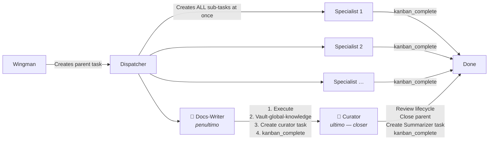

# Multi-Board Agent Architecture (Wingman + Boards)

## Overview

A hierarchical multi-agent pattern where a single **Wingman** agent acts as the sole user-facing authority, dispatching work through **Clienti** (ingress gateway) to specialized **Boards** — each a self-contained unit with dispatch, curation, summarization, and atomic role agents.

```
                    ┌──────────────────────┐
                    │       WINGMAN         │  ← single user contact
                    │    (max authority)     │
                    │    (NEVER executes)    │
                    └──────────┬───────────┘
                               │
                      ┌────────┴────────┐
                      ▼                 ▼
                ┌──────────┐    ┌──────────────┐
                │ CLIENTI  │───▶│  Bergamaschi  │
                │(dispatch) │    │   (& futuri)  │
                └────┬─────┘    └──────────────┘
                     │
                     ┌─────────┼──────────┬──────────┐
                     ▼         ▼          ▼          ▼
                     ┌─────────┐┌─────────┐┌─────────┐┌─────────┐
                     │SVILUPPO ││MARKETING││  ADMIN  ││  SALES  │
                     ├─────────┤├─────────┤├─────────┤├─────────┤
                     │9 atom.  ││9 atom.  ││7 atom.  ││10 atom. │
                     └─────────┘└─────────┘└─────────┘└─────────┘
                          ┌────────────────────────┐
                          │ CURATOR (global)        │
                          │ SUMMARIZER (global)     │
                          └────────────────────────┘
```

## ⚠️ HARD RULE: Wingman NEVER Executes Tasks Directly

The Wingman is a **collector, orchestrator, and supervisor** — NEVER an executor.

- The Wingman does **NOT** write code, design graphics, compose marketing copy, create offers, research leads, write outreach scripts, build brochures/portfolios, or perform any specialized domain work
- The Wingman does **NOT** implement anything — it decomposes and delegates everything to the appropriate Board
- The Wingman **MAY** do preliminary gathering (fetch data, read files, summarize context for delegation) — but ALL specialized execution goes to Boards, even if the task seems "small" or "faster to do directly"
- The Wingman's **only jobs**: listen → analyze → decompose → delegate to Board → supervise execution → collect results → summarize back to user

### HOW to delegate (CRITICAL)

The Wingman delegates by **creating a Kanban task**, not by calling `delegate_task` directly.

```bash
# ✅ CORRECT — create Kanban task, gateway dispatches to board profile
hermes kanban --board marketing create "Copy brochure" --assignee marketing --body "..." --goal --skill board-marketing

# ❌ WRONG — using delegate_task bypasses the board architecture entirely
# (the board dispatcher is the one who calls delegate_task internally)
```

The chain must be:
```
Wingman → Kanban task → Gateway (60s tick) → Board profile activates → Worker loads SOUL.md + board-* skill → Dispatcher role → delegate_task to atomic agent → Curator → Summarizer → task complete
```

Using `delegate_task` directly from the Wingman bypasses:
1. The board profile's SOUL.md (board identity never loads)
2. The board-* workflow skill (playbook never loads)
3. The Kanban lifecycle (no task tracking, no curator, no summarizer)
4. The atomic agent definitions (Wingman picks arbitrary agents)

**⚠️ CRITICAL SKILL-LOADING GAP:**

The dispatcher spawns workers with `hermes -p <board> --skills kanban-worker`.
This means the worker only loads `kanban-worker` — it does NOT auto-load
`board-{name}` (e.g. `board-marketing`). Without the board-{name} skill,
the worker doesn't know its workflow (dispatcher → curator → summarizer),
its atomic agents, or its mini-report format.

Two fixes (use BOTH):

1. **`--skill board-{name}` on kanban create** — the `--skill` flag in the
   kanban create command forces the worker to also load the board skill:
   ```bash
   hermes kanban --board marketing create "..." --assignee marketing --skill board-marketing --goal
   ```

2. **SOUL.md instruction** — the board's SOUL.md instructs the worker to
   `skill_view(name='board-{name}')` as its first action. This is the
   fallback when `--skill` is not passed (e.g. tasks created through other
   channels).

   ```markdown
   ## ⚠️ MANDATORY: workflow

   BEFORE working any task, load the board-{name} skill for the full playbook:
   `skill_view(name='board-{name}')`
   ```

## ⚠️ HARD RULE: Boards/ Files Are Sacred — Never Delete or Rename Original Agent Definitions

**58 agent markdown files** in `boards/` (4 dispatcher + 4 curator + 4 summarizer + 46 atomici). **NONE REMOVED — ALL INTACT.**

**Punto 4 risolto:** Curator e Summarizer non sono più orfani. Docs-writer (penultimo) crea task per Curator. Curator (ultimo) chiude parent + crea task per Summarizer. Dogmatizzato in vault-schema.md.

**The 50+ agent markdown files in `boards/` are the Canonical Agent Registry.** They are NOT temporary scaffolding or draft material. Every Hermes profile and every SOUL.md is derived FROM these files — the relationship is `boards/*.md → profiles/*/SOUL.md`, NOT the reverse.

### Why this matters (user preference)

The user has explicitly flagged concern about agent count preservation multiple times. Every session that touches architecture must verify and REPORT the count:

```markdown
- Original agents in boards/: {N} files
- Hermes profiles: {M} profiles
- All original agents preserved: ✅ (no files removed, no agents renamed)
```

### Rules

1. **NEVER delete a file from `boards/`.** You may add new files (new agents, new boards), but you may NOT delete or rename existing ones.
2. **NEVER rename an agent** in `boards/` — the name is its identity. If a role changes, add a new agent file and deprecate the old one (add a `deprecated: true` field in frontmatter — do NOT remove the file).
3. **Always count and verify** before and after any architecture change:
   ```bash
   find ~/wingman/boards -name "*.md" | wc -l
   # This number MUST NOT decrease across sessions
   ```
4. **When creating Hermes profiles** derived from board agents (e.g. `sviluppo-builder`), the profile's SOUL.md references the original agent file — it does NOT replace it.
5. **If a user asks "hai rimosso agent?"** or "i miei agenti originali sono ancora lì?", immediately run the verification count and report it before answering. Do NOT guess the count from memory.

### Verification (run this before claiming a session or architecture change is complete)

```bash
echo "=== Boards/ agent count ==="
find ~/wingman/boards -name "*.md" -type f | wc -l
echo ""
echo "=== Any deleted/renamed files ==="
cd ~/wingman && git diff --name-status HEAD boards/ 2>/dev/null || echo "(no git repo — manual check needed)"
```

## Board Structure (every board)

Each board has **3 fixed roles** and **N atomic agents**:

### Fixed Roles

| Role | Responsibility |
|------|---------------|
| **Dispatcher** | Receives tasks from Wingman (via Clienti), routes to the correct atomic agent. Routes cross-board requests when needed. |
| **Curator** | THREE responsibilities: (1) review quality of board output, (2) maintain all documentation produced by the board, (3) enforce repo hygiene (clean branches, proper PRs, issue triage) — can delegate fixes back to whoever created the mess. |
| **Summarizer** | Produces summaries of board activity for communication with Wingman and other boards. Compact, actionable, no filler. |

**⚠️ Per-board curator vs gateway curator:**

There are TWO curator levels that coexist:

1. **Gateway-level curator** (`hermes curator`) — runs automatically as a
   background process inside the gateway. It consolidates skills, manages
   snapshots, and prunes old sessions. This is always active and does NOT
   need per-board configuration.

2. **Per-board curator** (defined in `boards/{board}/curator.md` or the
   board's SOUL.md) — responsible for review quality of the board's
   specific deliverables: checking brand consistency, verifying facts,
   reviewing code quality, maintaining documentation. This role is performed
   by the board agent AS PART OF the board-{name} workflow skill, NOT as
   an independent background process.

**Key insight**: The per-board curator only runs when the board-{name} skill
is loaded AND the workflow is followed. If the agent is spawned without
board-{name} (see skill-loading gap above), the per-board curator never
activates — only the gateway curator runs, which doesn't know about
board-specific quality standards.

**To check if the per-board curator is working:**  
```bash
# Check global-knowledge diary for curator entries
grep "### Curator:" ~/wingman/vault-global-knowledge/diary.md | tail -5
# Or check if recent docs-writer task created a curator assignment task
hermes kanban --board {board} list --status all | grep "review:" | tail -5
```

### Atomic Agent Design Principles

- **Technology-agnostic**: roles describe the *function*, not the tool/library/framework
- **Atomic**: each role does exactly one thing. If a task spans multiple roles, Dispatcher chains them
- **Functional**: named after the outcome they produce (Builder, Reviewer, Negotiator), not their tech stack

## Design Workflow

1. **Brainstorm first** — map all teams, boards, and atomic roles before writing a single prompt. Start from Wingman → Clienti → Boards → atomic agents per board.
2. **Search second** — for each role, look up best existing agent definitions from known repos (awesome-claude-code-toolkit, ECC, etc.) as starting templates.
3. **Customize third** — adapt found prompts to the specific board context, adding board-specific constraints.

## Runtime Workflow

### Two Modes: Direct vs Chain

Depending on task complexity, the dispatcher chooses ONE of two modes:

#### Mode A: Direct (task semplice)

Dispatcher crea UN task direttamente per il builder (o specialista giusto).
Il worker esegue il lavoro direttamente con flusso lineare:

```
Phase:  Orient → Execute → Verify → Deliver
Role:   reader    executor   curator   summarizer
```

| Phase | Role | Action |
|-------|------|--------|
| 1 | **Orient** | `kanban_show` to verify task state and read full description. Load board-{name} skill via `skill_view(name='board-{name}')`. Understand what needs to be produced. |
| 2 | **Execute** | Work the task directly. YOU are the executor — create files, write code, produce deliverables. Use your tools (write_file, terminal, web_search, etc.). |
| 3 | **Verify** (self-curator) | Check quality of your own work. Verify deliverables are complete and correct. Fix issues before proceeding. |
| 4 | **Deliver** (self-summarizer) | Write summary to vault-global-knowledge diary: `~/wingman/vault-global-knowledge/diary.md` con prefisso board. Call `kanban_complete(summary='...')` or `kanban_block(reason='...')` — exiting without one of these is a **protocol violation** that crashes the task. |

#### Mode B: Chain — B1 Standard (task complesso) ★ PREFERRED

**B1 è lo standard.** Il dispatcher crea TUTTI i sub-task per la catena specialistica in una volta.
Ogni specialista esegue il suo compito e chiama `kanban_complete` — NON crea altri task.

```
┌──────────┐   ┌──────────┐   ┌──────────┐   ┌──────────────┐
│ ARCHITECT│ → │  BUILDER │ → │  TESTER  │ → │ DOCS WRITER  │
│ (primo)  │   │          │   │          │   │ (ULTIMO)     │
└──────────┘   └──────────┘   └──────────┘   └──────────────┘
     │              │              │               │
     └────── Tutti chiamano kanban_complete ───────┘
     (nessuno crea altri task — li ha già creati il dispatcher)
```

**Regole della catena B1:**

1. **Dispatcher crea TUTTI i sub-task** in una volta, SENZA `--skill`. Mai creare uno solo e aspettare.
2. **Ogni specialista esegue e completa** (`kanban_complete`). Mai più di un task per specialista.
3. **Docs-writer** (penultimo) documenta, aggiorna vault-global-knowledge, **crea task per Curator**. Curator (ultimo) revisiona e chiude il parent task.
4. **Solo se fallimento**, lo specialista riporta errori nel summary (non crea task di ritorno).
5. **`kanban_complete` è obbligatorio.** Protocol violation se un worker esce senza chiamarlo.

B2 (catena sequenziale con handoff) è **deprecato**. Vedi "Worker execution model" per dettagli.

**Catene per board:**

| Board | Catena B1 | Opzionali |
|-------|-----------|-----------|
| Sviluppo | architect → builder → tester → reviewer → docs-writer | data-modeler, integrator, ops, optimizer |
| Marketing | strategist → copywriter → visual-creator → publisher | analyst, community-manager, scheduler, seo-specialist, docs-writer |
| Sales | prospector → proposal-writer → negotiator → docs-writer | account-manager, collections-agent, competitor-analyst, crm-keeper, pricing-manager, revenue-tracker |
| Admin | **Pool** — dispatcher sceglie specialista giusto | — |

**⚠️ Protocol violation (regola critica):**

```
worker exited cleanly (rc=0) without calling kanban_complete or kanban_block — protocol violation
```

Ogni worker DEVE concludere con una chiamata esplicita a `kanban_complete(summary=...)` o `kanban_block(reason=...)`. Se non lo fa, il gateway marca il task come crashed e lo ritenta. La SOUL.md di ogni specialista DEVE concludere con questa istruzione esplicita.

**Contesto tra i passaggi:**
Lo specialista che passa il testimone include nel `--body` del nuovo task i risultati del suo lavoro. In questo modo lo specialista successivo non parte da zero:

```bash
# Builder → Tester: include contesto nel body
hermes kanban --board sviluppo create "TITOLO: test" \
  --body "COSTRUITO: {riepilogo}. FILE: {paths}. DA TESTARE: {cosa specifico}" \
  --assignee sviluppo-tester --parent TASK_ID
```

### Mini-Report Format (OBBLIGATORIO — tutti i task lo usano)

```
## Mini-Report
- task:      <id/nome>
- agente:    <nome>
- esito:     ✅ completato | ⚠️ parziale | ❌ fallito
- dettagli:  <2-3 righe, cosa fatto>
- note:      <bloccanti, decisioni, o "nessuna">
- todo:      <aperto/chiuso>
```

### Mini-Report Format (OBBLIGATORIO — tutti gli agenti lo usano)

```
## Mini-Report
- task:      <id/nome>
- agente:    <nome>
- esito:     ✅ completato | ⚠️ parziale | ❌ fallito
- dettagli:  <2-3 righe, cosa fatto>
- note:      <bloccanti, decisioni, o "nessuna">
- todo:      <aperto/chiuso>
```

THIS FORMAT IS MANDATORY — every agent produces one after every task. The Summarizer expects it and parses it. No exceptions.

### TODO Rules (ogni agente gestisce i propri)

1. **Aprire** un TODO appena ricevuto il task (via `todo tool`)
2. **Chiudere** il TODO a completamento
3. Task complesso → spezzare in sotto-TODO, non tenere un singolo TODO aperto ore
4. Se fallisce → TODO marcato fallito + causa nel mini-report

### Agent file format (each agent .md in boards/)

```yaml
---
name: <nome-agente>
description: <cosa fa in una riga>
board: <sviluppo|marketing|admin|sales>
type: atomic | dispatcher | curator | summarizer | commander
model: opus | sonnet | haiku           # recommended capability
tools: [Read, Write, Edit, Bash, ...]
---
```

The agent body is markdown — concise, domain-specific. User preference: keep each agent definition under 100 lines with no filler. "Poco, sintetico e fatto benissimo."

## Role Sources

| Repo | Strengths | Format |
|------|-----------|--------|
| `rohitg00/awesome-claude-code-toolkit` | 135 agents across 10 categories, strong frontend/UI | YAML frontmatter + Markdown |
| `affaan-m/ECC` | 62 agents, 235 skills, detailed code review checklists | Markdown with structured sections |
| `x1xhlol/system-prompts-and-models-of-ai-tools` | 140K+ stars, real-world system prompts | Raw system prompts |

## References

- `references/wingman-never-executes-pattern.md` — session-corrected workflow: the "keep results, delegate execution" pattern with before/after examples, Teo's exact correction, and anti-patterns to watch for.
- `references/client-offer-pricing.md` — worked example for Macelleria Bergamaschi pricing.
- `references/chain-architecture.md` — canonical chain definitions for all 4 boards (sviluppo, marketing, sales, admin) with specialist profiles, handoff commands, protocol violation prevention, and deployment checklist.
- `references/vault-documentation-conventions.md` — vault schema, 5 dogma rules, diary/conversations/wiki structure, resource placement, and blueprint procedure for adding new boards.
- `references/parent-task-auto-conclusion.md` — 7-step post-completion dogma: PARENT_ID, close parent via `hermes kanban complete`, curator/summarizer activation, verification checklist.
- `references/vault-schema-digest.md` — quick-reference: dove scrivere cosa dopo la centralizzazione vault-global-knowledge (SSOT per tutto il knowledge condiviso).
- `references/vault-cliente-structure.md` — struttura completa vault-cliente con milestones, sito, scadenze (template in `vault-cliente/_template/`).
- `references/mini-report-standard.md` — formato canonico mini-report per tutti gli specialisti atomic (30+ profili).

## Notes

- **Curator double-hats as docs maintainer + repo hygiene enforcer** — this is by design, not a gap. The Curator can delegate cleanup work back to the original author agent.
- Atomic agents should have a `docs-writer` in every board. The Curator maintains; the Docs Writer produces.
- `references/worker-flow-debugging.md` — Gateway dispatch, worker PIDs, unblocking, and CLI ordering pitfalls from real deployment.
- `references/` directory contains the canonical board definitions from each session, agent source references, VPS deployment guides (`references/vps-profile-setup.md`), and the chain architecture definitions (`references/chain-architecture.md`).
- **Chain architecture** (new, 2026-06-16): dispatcher → specialist chain with kanban_create handoffs. See `references/chain-architecture.md` for full chain mappings of all 4 boards, protocol violation prevention, duplicate prevention, and deployment checklist.

## Handling Preliminary Work (Wingman Research Before Delegation)

Sometimes the Wingman will already have started exploring a topic before the user corrects it and/or before it realizes the task should be delegated. When this happens:

1. **STOP executing immediately** — do not finish the work yourself
2. **Save what you've gathered** as structured context
3. **Delegate the specialized execution** to the appropriate Board, passing your findings as context so the Board doesn't start from zero
4. **Do NOT discard your findings** — the Board uses them as a starting point, not as something to redo

### Concrete example

| Wrong 🇽 | Right ✅ |
|---------|---------|
| Wingman researched brand naming (8+ options, domain checks, competitive analysis) and produced the final recommendation itself | Wingman passed its research as context to **Marketing Board**, which produced a structured analysis with scores, verification, and a clear #1 pick (Storefront 46/50) |

### What preliminary work IS acceptable for Wingman

✅ Reading existing files and configs to understand state  
✅ Gathering context from session_search (past decisions, constraints)  
✅ Decomposing a user request into sub-tasks for different boards  
✅ Summarizing what's known so the Board agent doesn't have to rediscover it  

❌ Writing final deliverables (copy, code, designs, offers, outreach scripts)  
❌ Making qualitative judgments that belong to domain experts (which brand name is best, what price point, which design)  
❌ Closing the loop without Board execution (the user never sees Board output because Wingman already "finished")

## Kanban Integration

Each board gets a dedicated Kanban board for task tracking. This is how tasks flow from Wingman to worker.

### Setup per board

```bash
# Create Kanban board
hermes kanban boards create <slug> --name "<Name>" --default-workdir ~/wingman/boards/<slug>/

# Set workdir (if deferred from creation)
hermes kanban boards set-default-workdir <slug> ~/wingman/boards/<slug>/

# Verify
hermes kanban boards list
```

### Profile routing

SINGLE GATEWAY model (recommended for small VPS): only the `default` profile runs the gateway (dispatch_in_gateway: true). Board profiles are `stopped` and only activated when a task is assigned to them.

**Task creation convention** — always pass both `--board` and `--assignee`:

```bash
hermes kanban --board sviluppo create "Titolo task" --assignee sviluppo --body "Descrizione" --goal
```

⚠️ CLINCHER: `--board` MUST come BEFORE the subcommand (`create`, `list`, etc.). The `--board` flag belongs to the `kanban` command group, not to individual subcommands. A common mistake is `hermes kanban create --board X` which fails with `unrecognized arguments: --board`.

**Recommended flags:**
- `--assignee <profile>` — quale profilo Hermes esegue il task (obbligatorio per dispatch)
- `--body "<descrizione>"` — descrizione del task
- `--goal` — (raccomandato per task aperti) attiva il goal-loop: il worker continua finché un giudice non conferma il completamento
- `--skill board-<board>` — forza il carico della workflow skill nel worker (es. `--skill board-marketing`)

This ensures:
- The task lives on the right board
- The gateway dispatches it to the correct profile's worker
- The worker loads the board-specific SOUL.md + skills

### Kanban dispatcher config (in config.yaml)

```yaml
kanban:
  dispatch_in_gateway: true           # gateway polls boards
  dispatch_interval_seconds: 60       # check every 60s
  failure_limit: 2                    # auto-block after 2 failures
  max_in_progress_per_profile: null   # no per-profile cap
```

### Reports → Vault-Global-Knowledge Convention

**All documentation targets `vault-global-knowledge/` — the single source of truth.**

```
~/wingman/vault-global-knowledge/diary.md    ← docs-writer aggiunge entry (con prefisso board)
~/wingman/vault-global-knowledge/wiki/       ← entità e decisioni globali
```

**Why:** Every piece of cross-board knowledge must live inside `vault-global-knowledge/` so that Obsidian sync, wikilinks, and cross-referencing work consistently across all boards. The old per-board vaults lost cross-board visibility; the old `reports/` directory was a flat file store with no vault integration.

**Transition:** Old reports in `~/wingman/reports/{board}/` are preserved as historical artifacts but are NOT read or updated by the active workflow. New documentation always targets `vault-global-knowledge/`.

Per-board vaults (sviluppo, marketing, admin, sales) host only BOARD-SPECIFIC data (stack, contacts, payments). Diary, decisions, entities globali, e conversations stanno solo in vault-global-knowledge.

### Worker execution model (TWO patterns)

A kanban worker operates in one of two execution modes depending on task complexity.

#### Pattern A: Direct execution (task semplice)

Each kanban worker is an INDEPENDENT executor. It is NOT an orchestrator that delegates to sub-agents.

- The worker receives ONE task and executes it directly, following Orient → Execute → Verify → Deliver
- There is NEVER a chain of `kanban-worker → delegate_task → atomic-agent` — this pattern causes worker crashes (infinite heartbeat loop until timeout, then "worker exited without calling kanban_complete or kanban_block")
- **Complex task** (entro i limiti di un singolo worker): split into sequential phases and execute them yourself, or create sub-tasks via `kanban_create` on the board (which get their own worker in the next dispatch cycle)
- The Dispatcher/Curator/Summarizer roles are PHASES the worker plays sequentially, not separate agent processes
- The kanban-worker skill explicitly says: *"Do NOT call delegate_task as a substitute for kanban_create. delegate_task is for short reasoning subtasks inside YOUR run."*

#### Pattern B: Chain delegation — B1 Standard (task complesso) ★ PREFERRED

For complex, multi-phase work, **B1 is the standard**. The dispatcher creates ALL sub-tasks at once; each specialist executes and completes. B2 (sequential handoff) is deprecated — see note below.

##### B1: Dispatcher creates ALL tasks (THE STANDARD)

User confirmed: *"Ma va bene se lo fa dispatcher, basta che gli ingaggi vengano fatti correttamente."*

```
Wingman → Kanban task → Gateway → Dispatcher (profile)
                                              │
                    crea TUTTI i sub-task      │
                    (--- senza --skill ---)    │
                                              ▼
              ┌──────────┬──────────┬──────────┬─────────────┐
              ▼          ▼          ▼          ▼
        [Specialist 1] [Specialist 2] [Specialist 3] [Specialist 4]
              │          │          │          │
              │  Tutti fanno solo: skill_view → execute → complete
              ▼          ▼          ▼          ▼
          kanban_    kanban_    kanban_    kanban_
          complete   complete   complete   complete
```

**Key constraints:**
- Dispatcher creates ALL sub-tasks (for every specialist in the chain)
- Each specialist does its work and calls `kanban_complete` — does NOT create more tasks
- Last specialist also calls `kanban_complete` and writes the report
- Context passes via `--body` on each `kanban_create`
- ALL workers MUST call `kanban_complete` or `kanban_block` — protocol violation otherwise
- Profiles for chain specialists (e.g. `sviluppo-builder`) must exist as separate Hermes profiles with their own SOUL.md

**⚠️ CRITICAL: Do NOT pass `--skill` on parent task**
The parent task MUST NOT carry `--skill board-{name}` because sub-tasks inherit the parent's skill flags. When a specialist profile (e.g. `sviluppo-builder`) activates, its `HERMES_HOME` points to `~/.hermes/profiles/sviluppo-builder/` — there are no skills there, so the inherited skill errors out:

```
Error: Unknown skill(s): board-sviluppo
pid 372691 exited with code 1
```
The sub-task enters a spawn-fail loop (2 retries, then blocked permanently).

**Fix:** create the parent task WITHOUT `--skill`. Both dispatcher and specialists load the skill on-demand via `skill_view(name='board-{name}')` in their SOUL.md. Sub-tasks inherit empty `skills: []` so they spawn cleanly:

```
# Dispatcher SOUL.md structure:
1. kanban_show
2. skill_view(name='board-{name}')         # ← load manually
3. Analyze, create ALL sub-tasks            # ← NO --skill flag
4. kanban_complete

# Specialist SOUL.md structure (e.g. sviluppo-builder):
1. kanban_show
2. skill_view(name='board-{name}')          # ← load manually
3. Execute your work
4. kanban_complete(summary="...")           # ← NO create more tasks
```

**Verification:**
```bash
# WITHOUT --skill → spawns cleanly
hermes kanban --board sviluppo create "test" --body "test" --assignee sviluppo-builder --goal

# WITH --skill → SPAWN FAIL (bug proof)
hermes kanban --board sviluppo create "test" --body "test" --assignee sviluppo-builder --skill board-sviluppo --goal
```

**Advantages over B2:**
- Specialists run in parallel (faster for independent work)
- Simpler specialist SOUL (no chain logic, just execute → complete)
- No duplicate tasks (dispatcher explicitly controls all tasks)
- Failure isolation (a failed specialist doesn't break the chain)

**Disadvantages:**
- More RAM pressure (all specialists run simultaneously)
- For sequential dependencies, B2 is better

##### ~~Sub-pattern B2: Each specialist creates the next~~ (DEPRECATO)

⚠️ **B2 non è più in uso.** La review architetturale del 2026-06-16 ha stabilito B1 come standard unico. B2 causava duplicazioni, desync tra SOUL.md e skill, e catene spezzate. Tutte le board usano B1.

Testo originale conservato per riferimento storico:

> ~~**Sub-pattern B2: Each specialist creates the next (ORIGINAL, for sequential workflows)**~~

```
Wingman → Kanban task → Gateway → Dispatcher (profile)
                                              │
                    crea SOLO primo sub-task   │
                    (B2: sequential handoff)   │

```
Wingman → Kanban task → Gateway → Dispatcher (profile)
                                              ```
                                                                  crea SOLO primo sub-task   │
                                                                  (B2: sequential handoff)   │
                                                                                            ▼
                                                                                      [Chain specialist 1]
                                              │
                                    kanban_create → [Specialist 2]
                                                           │
                                                 kanban_create → [Specialist 3] → ... → [Last specialist]
                                                                                               │
                                                                                     kanban_complete + report
```

**Key constraints:**
- Dispatcher creates EXACTLY ONE task (for the first specialist)
- Each specialist creates EXACTLY ONE task (for the next)
- Last specialist creates ZERO tasks (completes and reports)
- Context passes via `--body` on `kanban_create`
- ALL workers MUST call `kanban_complete` or `kanban_block` at the end — protocol violation otherwise
- Profiles for chain specialists (e.g. `sviluppo-builder`) must exist as Hermes profiles with their own SOUL.md

**⚠️ Common pitfall: Dispatcher creating ALL tasks at once (in B2 mode only)**
If the dispatcher creates all sub-tasks simultaneously under B2 rules (where each specialist creates the next), the chain duplicates when specialists try to create their next links because the next specialist already exists. Result: two workers on the same task, duplicate effort, potential conflicts.

**Fix:** Use B1 when dispatcher creates all tasks; use B2 only when dispatcher creates exactly ONE task (the first specialist).

**⚠️ Common pitfall: Protocol violation**
When a worker completes its work but exits without calling `kanban_complete`, the gateway treats this as a crash:
```
worker exited cleanly (rc=0) without calling kanban_complete or kanban_block — protocol violation
```
Every SOUL.md for chain specialists MUST end with `kanban_complete(summary=...)` as the final step. This is not optional.

**⚠️ Common pitfall: Skill inheritance from parent task (BOTH B1 and B2)**

When a sub-task is created via `kanban_create`, it INHERITS the parent task's `--skill` flags. If the parent was created with `--skill board-sviluppo`, the child gets `skills: ['board-sviluppo']`.

Causes a spawn crash because the specialist profile's HERMES_HOME points to `~/.hermes/profiles/sviluppo-builder/` — it cannot resolve skills from `~/.hermes/skills/`:

```
Error: Unknown skill(s): board-sviluppo
```
The child enters a spawn-fail loop (2 retries, then blocked permanently).

**Fix (for both B1 and B2):** Create the parent task WITHOUT `--skill`. Specialists load the skill via `skill_view()` in their SOUL.md. Sub-tasks inherit empty `skills: []` and spawn cleanly.

This is constrained by:
- `delegation.max_concurrent_children: 1` — only one atomic task can run at a time
- kanban-workers are spawned with limited toolsets and no delegate_task capability
- Workers run headless (no clarify tool) and must use `kanban_block` for human input

## Hermes Profiles: Per-Board Strategy

When deploying boards as isolated Hermes profiles, the key decision is **granularity**: one profile per board, not one per atomic agent.

### Decision Table

| Strategy | Profiles | RAM overhead | Isolation | Maintainability |
|----------|----------|-------------|-----------|----------------|
| **One profile per board** ★ | 4 | 0 (idle) / ~400 MB per active worker | Board-scoped memory & skills | Manageable |
| One profile per atomic agent | 50+ | Unusable on small VPS | Maximum | Impossible (50 profiles to update) |
| One profile for all | 1 | 0 | None (memory pollution across boards) | Simplest |

### Profile creation workflow

```bash
# Create per-board profiles
hermes profile create sviluppo
hermes profile create marketing
hermes profile create admin
hermes profile create sales

# Each gets 90+ bundled skills synced + a wrapper script in PATH
# Use directly: sviluppo chat, marketing chat, etc.
```

### SOUL.md per board (IMPORTANTE — workflow vehicle)

Each profile gets a SOUL.md that defines the board's identity AND workflow.
The SOUL.md is ALWAYS loaded (system prompt) — it is the PRIMARY vehicle for
workflow instructions, NOT just an identity statement.

```
~/.hermes/profiles/<name>/SOUL.md
```

**Why the SOUL.md carries the workflow (not a separate skill):**
- Agents spawned by the dispatcher use `--skills kanban-worker` only — they do
  NOT auto-load board-{name} skills unless explicitly instructed
- SOUL.md is always in the system prompt regardless of what `--skills` flags
  are passed, so embedding the workflow guarantees it's always present
- The SOUL.md tells agents to ALSO load the board-{name} skill via
  `skill_view(name='board-{name}')` for the full reference, while the compact
  workflow in the SOUL itself is always available as fallback

**Real SOUL.md structure (from Teo's 4-board setup):**

```markdown
You are the **{Board}** board agent for the Wingman architecture.
You coordinate {domain}.

You serve as Dispatcher, Curator, and Summarizer.
Collaborate with {other boards}. Do NOT handle {excluded work} — defer them.

## ⚠️ MANDATORY: workflow

BEFORE working any task, load the board-{name} skill for the full playbook:
`skill_view(name='board-{name}')`

The skill has agent definitions, mini-report format, cross-board rules, and
detailed procedures. What follows is a compact version you can use immediately.

## Workflow (compact)

When you receive a task, follow this sequence:

### 1. Orient
- `kanban_show` to verify task state and read full description
- Load the board-{name} skill: `skill_view(name='board-{name}')`
- Understand what needs to be done

### 2. Execute
- Work the task directly. YOU are the executor — create files, produce deliverables
- Complex task → split into phases and execute sequentially, or create sub-tasks via `kanban_create`
- **⚠️ NEVER use `delegate_task`** — the kanban-worker cannot delegate to sub-agents (max_spawn_depth=1, tool restrictions apply). The worker must execute the work itself.

### 3. Verify (self-curator)
- Self-review quality and completeness
- Fix issues before proceeding

### 4. Deliver (self-summarizer)
- Write summary to vault-global-knowledge diary: `~/wingman/vault-global-knowledge/diary.d/YYYY-MM-DDTHH-MM-{board}-{task_id}.md` (ISO timestamp in filename)
- Send 1-line summary to Telegram: `hermes send --to telegram "$SUMMARY_LINE" || echo "send failed - log only"` (opzionale — diary.d e' source-of-truth)
- Call `kanban_complete(summary='...', metadata={...})` o `kanban_block(reason='...')`

## Atomic Agents

{table of agents per board]

## Cross-board
{board-specific collaboration rules]

## References
{paths to relevant files}
```

**Key design property**: The SOUL.md compact workflow and the board-{name}
skill reference the SAME procedures. They are not competing documents — the
SOUL is the always-available fallback, the skill is the full authoritative
playbook loaded on demand for the full detail (mini-report format, agent
definitions, cross-board rules).

Example board tones:
| Board | Tone |
|-------|------|
| Sviluppo | concise, technically precise, action-oriented |
| Marketing | creative, data-driven, results-oriented |
| Admin | precise, organized, process-oriented |
| Sales | persuasive, organized, revenue-focused |

### Profile isolation semantics

- **Config**: inherited from root `~/.hermes/config.yaml` — overrides can be placed in `~/.hermes/profiles/<name>/config.yaml`
- **API keys**: inherited from root `~/.hermes/.env` — no copy needed
- **Memory & sessions**: fully isolated per profile (`memories/`, `sessions/` in profile dir)
- **Skills**: copied on creation (~8 MB, 90 skills) — should be pruned per board (see "Skill pruning per profile" below)
- **Gateway**: only the default profile runs the gateway; board profiles are stopped and only activated on demand (via Kanban or CLI wrapper)

### Skill pruning per profile

Each profile is created with all 90+ bundled skills, but a marketing board doesn't need GitHub coding tools, and an admin board doesn't need creative image generators. Pruning reduces token overhead at profile load time and keeps the agent focused on its domain.

**Shared infrastructure skills** — keep these in EVERY profile regardless of board:
  - `hermes-agent`, `kanban-orchestrator`, `kanban-worker`, `native-mcp`
  - `writing-plans`, `spike`, `systematic-debugging`, `requesting-code-review`
  - `subagent-driven-development`, `hermes-agent-skill-authoring`

**Pruning workflow:**

1. **List** the profile's current skills:
   ```bash
   hermes -p <profile-name> skills list
   # or inspect the directory:
   ls ~/.hermes/profiles/<name>/skills/
   ```

2. **Remove bulk categories** irrelevant to the board. Categories are subdirectories under the profile's `skills/`:
   ```bash
   # Remove creative/media from a development profile
   rm -rf ~/.hermes/profiles/sviluppo/skills/creative
   rm -rf ~/.hermes/profiles/sviluppo/skills/media
   # Remove dev/mlops from a marketing profile
   rm -rf ~/.hermes/profiles/marketing/skills/{github,mlops,software-development}
   ```

3. **Restore accidentally removed skills** from the root skills directory:
   ```bash
   cp -r ~/.hermes/skills/<category>/<skill> ~/.hermes/profiles/<profile>/skills/<category>/
   ```

4. **Verify** the final count:
   ```bash
   find ~/.hermes/profiles/<name>/skills -name 'SKILL.md' | wc -l
   ```

**Real reference counts** (from a 4-board setup on 1.8 GiB / 2 vCPU VPS):

| Profile | Skills after pruning | Focus |
|---------|---------------------|-------|
| sviluppo | 46 | dev, github, mlops-inference |
| marketing | 54 | creative, media, social, research |
| admin | 29 | productivity, smart-home, email |
| sales | 31 | social, research, productivity, email |

Total on disk across all 4 profiles: ~16 MB — negligible overhead.

**Recovery pattern**: if a pruned skill is needed later, copy it from `~/.hermes/skills/<category>/<name>/` into the profile's `skills/<category>/` directory. No profile re-creation needed.

### ⚠️ Skill sync: use symlinks, not copies

All board-{name} skills inside profiles MUST be symlinks to the root `~/.hermes/skills/`, NOT independent copies. Rationale:

| Approach | Problem |
|----------|--------|
| **Copies** ❌ | Skills drift — root gets updated (B1 flow, Curator closer), profiles load stale version. **16 copies were stale** on 16/06/2026. |
| **Symlinks** ✅ | One edit at root propagates to every profile. Zero sync effort. |

**How to set up a new profile:**
```bash
hermes profile create <name>
# Remove the copied skill dir, replace with symlink
rm -rf ~/.hermes/profiles/<name>/skills/autonomous-ai-agents/board-{name}
ln -sf ~/.hermes/skills/autonomous-ai-agents/board-{name} ~/.hermes/profiles/<name>/skills/autonomous-ai-agents/board-{name}
```

**Verification:**
```bash
ls -la ~/.hermes/profiles/<name>/skills/autonomous-ai-agents/board-{name}
# Should show: .../board-{name} -> /home/hypnosis/.hermes/skills/.../board-{name}
```

**Design principle**: skills follow function, not symmetry. A board has skills only for its domain. If a cross-domain task arises (e.g., marketing needs a quick script), the Dispatcher routes it to the board that owns those skills rather than bloating every profile with everything.

## VPS Resource Budgeting

For small VPS deployments (1.8 GiB RAM / 2 vCPU / 79 GB disk typical), each Hermes instance uses ~300-400 MiB RSS. Plan accordingly:

### Measuring real resource usage

Before planning, measure actuals — don't rely on estimates:

```bash
# RAM: total, used, available, swap
free -h

# Or more precise via /proc
grep MemAvailable /proc/meminfo

# Identify all RSS hogs — sort by %MEM descending
ps aux --sort=-%mem | head -15

# Hermes profile disk footprint (negligible, but verify)
du -sh ~/.hermes/profiles/*/

# Gateway PID (if running) → exact RSS
ps -p $(pgrep -f 'gateway run' | head -1) -o pid,rss,cmd --no-headers 2>/dev/null
```

**Critical**: other processes (Claude CLI ~306 MiB, Docker ~200 MiB, web servers, fail2ban, journald) eat into the same RAM. `free -h` shows what's available after all of them, not just after Hermes. Always check `ps aux` before budgeting.

### Capacity Formula

```
Available RAM = MemAvailable from /proc/meminfo
Max Hermes instances = floor(Available RAM / 350 MiB)
Safe concurrent workers = Max Hermes instances - 1 (reserve for gateway)
```

### Example: 1.8 GiB VPS (real measured baseline)

Real measurement from a running system (Jun 2026, 2 vCPU, 1.8 GiB RAM, 8 GiB swap):

| Process | RSS | %MEM |
|---------|:---:|:----:|
| Hermes gateway | 380 MiB | 20.0% |
| Claude CLI | 306 MiB | 16.1% |
| Docker daemon | 32 MiB | 1.6% |
| System baseline (journald, fail2ban, systemd, etc.) | ~200 MiB | ~10% |
| **Total baseline** | **~1.2 GiB** | **~67%** |
| **Remaining** | **~300 MiB** | **~17%** |

Without Claude CLI, the margin improves substantially (~600 MiB available).

| Scenario | Hermes processes | RAM est. | Feasible |
|----------|-----------------|----------|----------|
| Gateway only | 1 | 381 MiB | ✅ (600 MiB avail w/o Claude) |
| Gateway + 1 worker | 2 | ~750 MiB | ⚠️ only if Claude is off |
| Gateway + 2 workers | 3 | ~1.1 GiB | ❌ heavy swap even w/o Claude |
| Gateway + 3+ workers | 4+ | >1.5 GiB | ❌ saturation |

**Takeaway**: on this VPS, run only ONE Hermes gateway. Board profiles stay idle (zero RSS). Worker tasks are short-lived (~50-100 MiB temporary). Keep Claude CLI closed when not actively coding. If you need more parallelism, upgrade to 4+ GiB RAM.

### Mitigations

1. **`delegation.max_concurrent_children: 1`** — never more than 1 Kanban worker at a time
2. **Swap**: increase to 8 GB for peak cushion (`fallocate -l 8G /swapfile && mkswap && swapon`)
3. **Local workers** over Docker workers (Docker adds ~200 MB per container)
4. **Prune skills per profile** — keep only board-relevant skills (disk is cheap, but loaded skills consume token budget)
5. **2 vCPU limit**: more than 2 concurrent Hermes processes degrade perceptibly on small machines

## Agent File Format & Filesystem Layout

The standard format for agent definitions is **YAML frontmatter + Markdown** (adopted from `awesome-claude-code-toolkit`):

```yaml
---
name: architect
description: Definisce architettura del sistema, struttura del progetto, dependency graph
board: sviluppo
type: atomic            # atomic | dispatcher | curator | summarizer | commander
model: opus             # recommended model capability
tools: [Read, Write, Edit, Bash, Glob, Grep]
---
# Agent Body
Sei l'architetto del Board Sviluppo...
```

### Filesystem structure

```
wingman/
├── AGENTS.md                ← Indice generale (tutti gli agenti con ispirazioni)
├── wingman.md               ← Wingman (commander, unico interlocutore)
├── clients/
│   └── dispatcher.md        ← Ingresso clienti, dispatch ai board
└── boards/
    ├── sviluppo/            ← 1 dispatcher + 1 curator + 1 summarizer + N atomic
    ├── marketing/
    ├── admin/
    └── sales/
```

Each board directory has exactly: one `dispatcher.md`, one `curator.md`, one `summarizer.md`, and one file per atomic agent.

## Client Offer & Pricing Creation Workflow

When a potential client asks about services/pricing (e.g. "quanto costa?", "cosa include?", "vorrei sapere i prezzi"), use parallel board delegation to produce a complete offer.

### The pattern

```
Client asks about services/pricing
        │
        ├──→ delegate_task [Marketing board] ──→ service tiers, content counts,
        │                                          try&buy scope, service thresholds
        │
        └──→ delegate_task [Sales board] ──────→ pricing, competitive positioning,
                                                   combination scenarios, payment terms
        │
        ▼
     Merge both outputs into a single client-ready offer document
        │
        ▼
     Present FULL document to user (never summarize, never assume "sent")
```

### Step-by-step

1. **Identify the class of work**: client asking about "costs", "services", "what's included", "tiers" — this is NOT a quick answer, it's a multi-agent production task.

2. **Delegate Marketing subagent** (strategist/copywriter orientation) to define:
   - Service tiers with precise content counts (post/settimana, stories, reel, aggiornamenti sito)
   - "Try & buy" scope (limited social content included in site tiers)
   - Service thresholds (SLA, revisioni, report)
   - What IS and IS NOT included per tier
   - Brand positioning language

3. **Delegate Sales subagent** (pricing-manager/proposal-writer orientation) to define:
   - Pricing structure (one-time + recurring)
   - Competitive positioning narrative
   - Combination scenarios (client type → recommended combo)
   - Payment terms, cancellation policy
   - Questions to qualify the client's tier

4. **Merge and polish**: Read both outputs, reconcile any conflicts, produce a single document with:
   - Part 1: Core service (e.g. sito web) with one-time cost
   - Tiered management with try&buy
   - Part 2: Separate premium service (e.g. social management) with 3 tiers
   - Combination scenarios with total cost year 1 + recurring
   - Qualifying questions
   - Terms & conditions

5. **Present the FULL document** — never say "mandata pure" as if sent. Show the complete file content directly in the response. The user will confirm before it goes anywhere.

### Pitfalls

- **Never summarize the offer** — the user needs to see the full pricing table to approve it. Summaries hide details (content counts, SLA thresholds) the user needs to validate.
- **Never say you "sent" or "mandata"** anything unless the user explicitly confirmed. Present, don't deliver.
- **Always recover past pricing discussions** with `session_search(query="pricing costi tier prezzo")` before proposing new numbers. The user gets frustrated when you propose prices that contradict earlier agreements.
- **When the user says "recuperali [i costi]"**, use `session_search` immediately — don't guess or infer from partial memory.
- **Two independent agents may produce conflicting tier names/structures** — resolve differences during merge (e.g. use the Marketing agent's tier names and the Sales agent's pricing, not both).

### Bundle Creation — Combining Services with Savings

When the user asks to create "bundle" packages (combo of site + social at a discounted monthly rate), follow this pattern:

#### Structure (3 tiers, ascending)

```
Bundle ENTRY  → essential service + minimal social (target: small biz/lone pro)
Bundle MID    → mid-tier site + multi-platform social (target: PMI/restaurants)
Bundle TOP    → full site + all-platform social + ads (target: structured companies)
```

#### Pricing rules

- **One-time stays fixed** — site €750 is never discounted in a bundle. The discount applies only to the monthly recurring fee.
- **Monthly discount**: 10–20% off the combined standalone monthly price. Aggressive enough to incentivize the bundle, not so aggressive that standalone feels overpriced.
- **Standalone always costs more** — if a client buys site and social separately, they pay full price. The bundle is the "smart choice."
- **Upgrade path**: customer can move up a bundle tier at any time (pay the difference). Downgrade with 30 days notice.

#### Savings comparison table

For EVERY bundle, produce a tabular comparison:

| | **Noi (Bundle)** | **Agenzia Tradizionale** | **Freelance** |
|------|:-:|:-:|:-:|
| Sito (una tantum) | **€750** | €6,000–12,000 | €2,000–5,000 |
| Manutenzione/mese | ✅ included | €200–500/mese | €80–150/mese |
| Social management/mese | ✅ included | €800–2,000/mese | €300–800/mese |
| **Canone mensile totale** | **€99** (o €139/€299/€649) | **€1,200** | **€430** |
| **Costo primo anno** | **€1,938** | **€20,400** | **€8,160** |
| **Costo annuo ricorrente** | **€1,188** | **€14,400** | **€5,160** |

Always use the MID range of agency/freelance pricing (not the minimum — credibility; not the maximum — scare factor). Source the ranges from actual market research (see `references/client-offer-pricing.md` for competitor benchmarks).

#### Visual savings statements

After each bundle, write three bolded savings lines:

```markdown
**Risparmi €X al primo anno rispetto a un'agenzia tradizionale**
**Risparmi €Y al primo anno rispetto a un freelance**
**Risparmi €Z ogni anno dopo il primo rispetto a un'agenzia**
```

#### Bundle conditions (include in every offer)

- Bundle valid only if client buys BOTH site and social
- Site one-time unaffected (€750)
- Upgrade/downgrade always possible (30 days for downgrade)
- 30-day cancellation, no penalties
- First month money-back guarantee
- Annual prepayment option → additional ~10% discount

#### Combined board orchestration

Instead of delegating Marketing and Sales as **two parallel tasks** and manually merging, you can use a **single orchestrator subagent** that handles both domains internally:

```python
delegate_task(
    goal="Produce a bundle offer with 3 tiers, savings comparison, and conditions",
    context="<all pricing data, competitor benchmarks, structure rules>",
    role="orchestrator",
    toolsets=["terminal", "file"]
)
```

**When to use parallel delegation** (the standard pattern in "Client Offer & Pricing Creation Workflow" above):
- The user asks for separate Marketing and Sales outputs (reviewable independently)
- The boards have different assigned profiles/agents
- You want to compare two independent takes before merging

**When to use the single orchestrator** (this session's pattern):
- Speed: one subagent produces the complete output in a single session
- The task is well-bounded (bundle structure is defined, not exploratory)
- The user asked for a unified deliverable, not separate drafts

Both patterns are valid; pick based on whether you need independent review or fast unified output.

### Concrete example reference

See `references/client-offer-pricing.md` for a worked example (Macelleria Bergamaschi — €750 site + €30/€120/€300 site tiers with try&buy social + €79/€250/€500 social management tiers).

---

## Parallel Research Workflow

When designing a new multi-board architecture from scratch, follow this process:

1. **Brainstorm all roles first** (board by board, Wingman → Clienti → Boards → atomic agents). No implementation research until the full role map is drafted.

2. **Search in parallel using delegate_task** — spawn up to 3 subagents simultaneously, each assigned to a board or group of boards, to find the best existing agent definitions from known public repos.

3. **Create agent files in batch** — the standard agent definition contains: role name, description, responsibilities, workflow, guiding principles. Technology-agnostic and atomic per role.

4. **Reference sources in AGENTS.md** — every agent file should track which public repo inspired it (for attribution and future updates).

Known best repos for agent templates: `rohitg00/awesome-claude-code-toolkit` (large, well-organized), `affaan-m/ECC` (very detailed checklists), `x1xhlol/system-prompts-and-models-of-ai-tools` (raw real-world prompts).

---

## Multi-Workstream Delegation Workflow

When the user gives a complex, multi-pronged request (e.g. "fammi brochure + hook email + pipeline lead"), the Wingman must decompose it into independent workstreams, map them to boards, manage dependencies, and supervise execution.

### Step 1 — Decompose into lanes

Read the request and extract the distinct workstreams. Each lane must be a self-contained unit of work that a single board can own. Common lanes in the user's business:

| Lane | Typical board | Example |
|------|--------------|---------|
| Marketing content | Marketing | Brochure copy, email hooks, social strategy |
| Technical build | Sviluppo | HTML/PDF generation, site templates |
| Sales infrastructure | Sales | Lead pipeline, contact scripts, CRM |
| Brand / Admin | Admin | Pricing docs, contracts, business processes |

**Signals for decomposition**: each "and" or "anche" in the request signals a separate lane. "Brochure + hook email + pipeline lead" → 3 lanes.

### Step 2 — Map lanes to boards

Each lane maps to exactly one board. If a lane genuinely spans two boards (e.g. "email hook" could be Marketing copy + Sales messaging), assign it to the board whose primary domain it is (Marketing for copy, Sales for outreach scripts). The other board's requirements are passed as context.

For Teo's setup, the 4 boards with their domains:

| Board | Owns | Does NOT own |
|-------|------|-------------|
| **Marketing** | Copy, messaging, brand voice, content strategy | Code, pricing definitions, lead databases |
| **Sviluppo** | HTML/CSS/PDF builds, code, technical deliverables | Copywriting, pricing, sales strategy |
| **Sales** | Lead gen, outreach scripts, CRM, pipeline | Design decisions, content tone |
| **Admin** | Pricing, contracts, process docs, brand consistency | Creative work, lead execution |

### Step 3 — Build the dependency graph

Some lanes depend on others. Identify true data dependencies vs. independent work.

- **Independent** — can run in parallel: Marketing content + Sales pipeline
- **Dependent** — input flows from one board to another: Marketing content → Sviluppo build (Sviluppo needs the copy before it can build the brochure)
- **Unrelated** — no interaction at all: can be parallelized freely

Dependency matrix for common multi-workstream requests:

```
Brochure:        Marketing (content) ──→ Sviluppo (HTML/PDF)
Email hooks:     Marketing (copy)  ──→ Sales can use when done
Lead pipeline:   Sales (pipeline)   │  (independent of Marketing)
                                    ▼
                             All → Admin (brand check)
```

### Step 4 — Delegate with rich context

When calling `delegate_task`, each subagent needs:

1. **Who they are** — "Sei l'agente MARKETING/SALES/SVILUPPO/ADMIN"
2. **Full business context** — pricing, target audience, zona operativa, pilot strategy, tone
3. **Clear output specification** — exact files to create, format, sections
4. **Constraints** — things to avoid, prior decisions, user preferences
5. **Tools** — terminal + file for code/build work, can add web for research

Example context structure:

```
## CONTESTO
Sei l'agente [BOARD NAME]. [Board's role description]

## DATA FISSE
[All fixed numbers, prices, names the agent needs]

## OUTPUT RICHIESTO
[Numbered list of exact deliverables with file paths]

## VINCOLI
[Prior decisions, things to avoid, style requirements]
```

### Step 5 — Coordinate execution

Launch pattern for dependent workstreams:

```
Batch 1 (parallel):     Batch 2 (sequential):
┌──────────────┐      ┌──────────────┐
│ Marketing    │      │ Sviluppo     │ ← waits for Marketing content
│ Sales        │ ────→│ (brochure)   │
└──────────────┘      └──────────────┘
                           then
                      ┌──────────────┐
                      │ Admin review │
                      └──────────────┘
```

Implementation pattern:

```python
# BATCH 1 — parallel, no dependencies
results = delegate_task(tasks=[
    {"goal": "...", "context": "...", "toolsets": ["terminal", "file"]},
    {"goal": "...", "context": "...", "toolsets": ["terminal", "file", "web"]},
])

# BATCH 2 — sequential, after reviewing Marketing output
delegate_task(
    goal="Build brochure from Marketing content",
    context=f"Content is ready at ~/wingman/brochure-content.md. ...",
    toolsets=["terminal", "file"],
)
```

### Step 6 — Supervise and report

After each batch completes:

1. **Read the summary** — delegate_task returns a structured summary with file paths, line counts, and key findings
2. **Verify deliverables exist** — check file sizes, PDF validity, content completeness
3. **Report to the user** — per-board breakdown with file list, key decisions made, and any issues
4. **Flag quality issues** — don't let agents pass off stale/wrong output. If pricing is wrong or content is off-tone, note it

**Never close the loop without showing the user what was produced.** Deliverables live in `~/wingman/`. The user reviews and approves before anything goes to a client.

### Common multi-workstream patterns in this business

| Request | Lanes | Dep graph | Recommended batches |
|---------|-------|-----------|-------------------|
| "Brochure + hook + lead pipeline" | Marketing (content + hooks) + Sales (pipeline) + Sviluppo (brochure build) | Marketing→Sviluppo, Sales independent | Batch 1: Marketing + Sales || Batch 2: Sviluppo |
| "Offerta cliente + contatto" | Marketing (offer copy) + Sales (pricing + outreach) | Independent | Single batch: both in parallel |
| "Sito + social per nuovo cliente" | Sviluppo (site build) + Marketing (social strategy) | Independent | Single batch: both in parallel, Admin review after |
| "Contatta lead lista" | Sales (execution) | No dependencies | Single delegation to Sales |

### Pitfalls

- **Don't start executing yourself** — even "just checking the file" is a slippery slope. Use `delegate_task` or `read_file` in your supervision role, not terminal commands for implementation.
- **Don't merge lanes onto one board that should be split** — Marketing does copy; Sviluppo does builds. Letting Marketing do the HTML is as wrong as letting Sviluppo write the copy.
- **Don't forget the upstream file path** — when Batch 2 depends on Batch 1 output, include the exact file path in the context so the next agent can read it directly.
- **Don't assume agents share your context** — every `delegate_task` call is a fresh session. Full context must be in the context parameter.
- **Don't skip verification** — an agent that claims "PDF created" may have produced an empty or corrupted file. Verify with file size check in your supervision step.
- **Too many tiny delegations** — adding more than 3-4 agents for a single request creates overhead without proportional value. Group related tasks.

## ⚠️ CRITICAL: SOUL.md / board-skill synchronization

The profile's SOUL.md and its board-{name} skill (e.g. board-marketing) contain the SAME workflow but at different loads:

| Document | When loaded | Role |
|----------|-------------|------|
| **SOUL.md** (`~/.hermes/profiles/{name}/SOUL.md`) | ALWAYS — in system prompt | Compact authoritative workflow |
| **Board skill** (`~/.hermes/skills/board-{name}/SKILL.md`) | On-demand via `skill_view(name='board-{name}')` | Full detail, reference |

### Rule: SOUL.md is authoritative. Keep them synchronized.

The SOUL.md is loaded FIRST (system prompt) and is always present. The board skill is loaded SECOND (on demand). If they contradict, the agent follows the SOUL.md's workflow because that's what it sees first and always.

**Real crash from desynchronization (this session's bug):**

The previous session updated ALL 4 board-{name} skills to the correct linear flow (Orient → Execute → Verify → Deliver, no delegate_task). But the SOUL.md files were NOT updated — they still said "use delegate_task to atomic agents."

Result: every worker on the Sviluppo board that received a complex task tried to delegate_task → couldn't → entered an infinite heartbeat loop (~20 min) → timed out with "worker exited cleanly without calling kanban_complete or kanban_block." Three tasks crashed this way before the fix.

**Verification checklist after any workflow change:**

```bash
# Check SOUL.md for delegate_task references
grep -n "delegate_task" ~/.hermes/profiles/*/SOUL.md

# Check board skills for delegate_task references
grep -n "delegate_task" ~/.hermes/skills/board-*/SKILL.md

# If either has it, BOTH need the same fix
# Expected: 0 results (no delegate_task in workflow descriptions)
```

**When modifying the workflow, ALWAYS update both files in the same turn:**

1. `~/.hermes/profiles/{board}/SOUL.md` — compact workflow (immediate, always-loaded)
2. `~/.hermes/skills/board-{board}/SKILL.md` — full reference (loaded on-demand)

The two documents should describe the SAME workflow at different levels of detail. If they diverge, the agent follows the SOUL.md — which may be outdated or wrong.

---

## Self-Consistency Protocol

The architecture MUST be self-consistent: every agent knows what to do, who to engage after its work, and how to persist knowledge. This protocol documents the invariants and automated workflows that maintain system integrity.

### Invariant 1: Task Lifecycle Completeness

Every task goes through this lifecycle. NO phase is optional.



**Regola task semplice** (fix minore): dispatcher → specialista → specialista crea task per Curator → Curator chiude. Nessun docs-writer intermedio.

**Regola fallimento**: se uno specialista fallisce, Curator non riceve task. Parent task NON va chiuso. Il dispatcher umano decide se ricreare.

### Invariant 2: Post-Completion

Ogni specialista cerca `PARENT_ID: {id}` nel body del task (passato dal dispatcher).

**Docs-Writer (penultimo)** — si ferma dopo documentazione:

```markdown
## Docs-writer post-completion
1. Complete specialist work (documentation, deliverables)
2. Update vault-global-knowledge diary: `~/wingman/vault-global-knowledge/diary.md` con prefisso del board (`## YYYY-MM-DD | {Board}: {task} — {summary}`)
3. Create task for Curator with PARENT_ID:
   `hermes kanban --board {board} create "review: {task}" --body "PARENT_ID: {PARENT_ID}. Review full lifecycle." --assignee curator --parent {PARENT_ID}`
4. **kanban_complete** — NON chiudere il parent
```

**Curator (ultimo, closer)** — l'unico che chiude il parent task:

```markdown
## Curator post-completion
1. Review FULL lifecycle of parent task:
   - diary entry complete?
   - entities created → wiki page?
   - decisions → documented in wiki/decisions/?
   - report → updated?
   - format consistent (all mini-reports)?
   - wikilinks coherent?
2. If all OK:
   a. Close parent task: `hermes kanban --board {board} complete {PARENT_ID}`
   b. Create task for Summarizer (cross-board report)
   c. **kanban_complete**
3. If problems:
   a. **kanban_block** with details — parent task stays open
```

**Regola fallimento**: se uno specialista fallisce, segnala nel summary. Curator non riceve task. Parent task NON va chiuso.

### Invariant 3: Curator Activation

Il Curator NON è mai uno zombie. Viene attivato via kanban task dal docs-writer (penultimo specialista, see Invariant 2 step 4).

Il Curator riceve un corpo che specifica:
- Quale vault revisionare
- Quali task sono stati completati
- Cosa verificare (nuove entità, decisioni, coerenza wikilink, formato diary)
- **PARENT_ID: {id}** — obbligatorio per chiudere il parent se OK

```bash
# Task per Curator (creato da docs-writer)
hermes kanban --board sviluppo create "review: task TITOLO" \
  --assignee curator \
  --body "PARENT_ID: {parent_id}. Review vault-sviluppo for task TITOLO. Check: diary entry, entities created, decisions documented, wikilinks consistency, mini-report format in completed sub-tasks." \
  --parent {parent_id}
```

Il Curator:
1. Legge `PARENT_ID` nel body — necessario per chiudere il parent
2. Legge `~/wingman/vault-global-knowledge/diary.md` (ultima entry del board)
3. Verifica che le entità create abbiano pagina wiki in `vault-global-knowledge/wiki/entities/`
4. Verifica che eventuali decisioni siano documentate in `vault-global-knowledge/wiki/decisions/`
5. Verifica formato consistent (tutti i mini-report usano lo stesso template)
6. Se tutto OK → chiude parent + crea task per Summarizer + kanban_complete
7. Se problemi → kanban_block con dettagli — parent task resta aperto

### Invariant 4: Summarizer Activation

Il Summarizer viene attivato via kanban task dal Curator (Invariant 2 step 2b).

```bash
# Task per Summarizer (creato da Curator)
hermes kanban --board sviluppo create "summary: task TITOLO" \
  --assignee summarizer \
  --body "Parent task {parent_id} closed. Aggiorna vault-global-knowledge/diary.md con report finale. Leggi vault-global-knowledge/diary.md per contesto." \
  --parent {parent_id}
```

Il Summarizer produce un report incrociato che scrive in `~/wingman/vault-global-knowledge/diary.md` (aggiornamento direttamente nel diary globale). Include:
- Cosa è stato fatto (board + task)
- Decisioni emerse
- Bloccanti
- Prossimi passi

### Invariant 5: Vault Auto-Update (Carico del Docs-Writer)

Il docs-writer (penultimo) è RESPONSABILE di aggiornare il vault dopo il suo lavoro. Non è un compito separato — fa parte del suo lavoro.

Cosa aggiornare:

| Cosa | Dove | Formato |
|------|------|---------|
| Diary | `vault-global-knowledge/diary.md` | `## YYYY-MM-DD | {Board}: {task title} — {summary}` |
| Entità create globali | `vault-global-knowledge/wiki/entities/{name}.md` | Frontmatter + descrizione + referenze |
| Decisioni | `vault-global-knowledge/wiki/decisions/{topic}.md` | Contesto + decisione + motivazione |

### Invariant 6: Design Self-Consistency

Tutti i 50 agent markdown in boards/ DEVONO rimanere intatti e aggiornati. Ogni modifica a un profilo Hermes (SOUL.md) o a una board skill DEVE avere corrispondenza nei file markdown originali:

```
boards/{board}/{agente}.md  ←→  ~/.hermes/profiles/{board}-{agente}/SOUL.md
```

Se un SOUL.md viene modificato, il corrispondente .md in boards/ DEVE essere aggiornato nella stessa sessione. Se un .md in boards/ viene modificato, il SOUL.md DEVE essere aggiornato.

### Verification Check

Prima di dichiarare una sessione completata, verifica:

```bash
# 0. Document everywhere — check all doc sites for the gap you resolved
grep -rn "Punto <N>\|<gap name>\|<change description>" vault-schema.md blueprint-*.md gap-analysis-*.md
# Expected: hits in vault-schema Dogmi Risolti + blueprint + gap-analysis + affected skills

# 1. Nessun ref a profili inesistenti (zombie refs)
grep -rn "admin-organizer\|admin-legal-writer\|admin-auditor\|admin-archiver" boards/ skills/

# 2. B1/B2 sync — nessuna skill dice B2
grep -l "non crea più di un task\|crea solo il primo\|ogni specialista crea il task per il successivo" ~/.hermes/skills/board-*/SKILL.md

# 3. Vault non hanno roba orfana (senza referenze)
find ~/wingman/vault-*/ -type f | while read f; do [ -s "$f" ] || echo "EMPTY: $f"; done

# 4. SOUL.md e board skill allineati (stesso flusso)
grep -c "delegate_task" ~/.hermes/profiles/*/SOUL.md ~/.hermes/skills/board-*/SKILL.md
# (dovrebbe essere 0 — nessun workflow usa più delegate_task)

# 5. Nessun ref residuo a vault-{board}/diary.md (deve puntare a global-knowledge)
grep -rn "vault-sviluppo/diary\|vault-marketing/diary\|vault-admin/diary\|vault-sales/diary" \
  ~/.hermes/skills/autonomous-ai-agents/ ~/.hermes/profiles/
# (dovrebbe essere 0 — tutto punta a vault-global-knowledge)

# 6. Tutti i 50 agent markdown esistono ancora (⚠️ HARD RULE: Boards/ Files Are Sacred)
find ~/wingman/boards -name "*.md" | wc -l  # must not decrease
```

### References for Self-Consistency

- `references/gap-analysis-2026-06-16.md` — full gap analysis this protocol was derived from
- Each board's `SKILL.md` now has updated B1 rules (checked 2026-06-16)
- vault-schema.md in vault-admin — dogma vault structure
